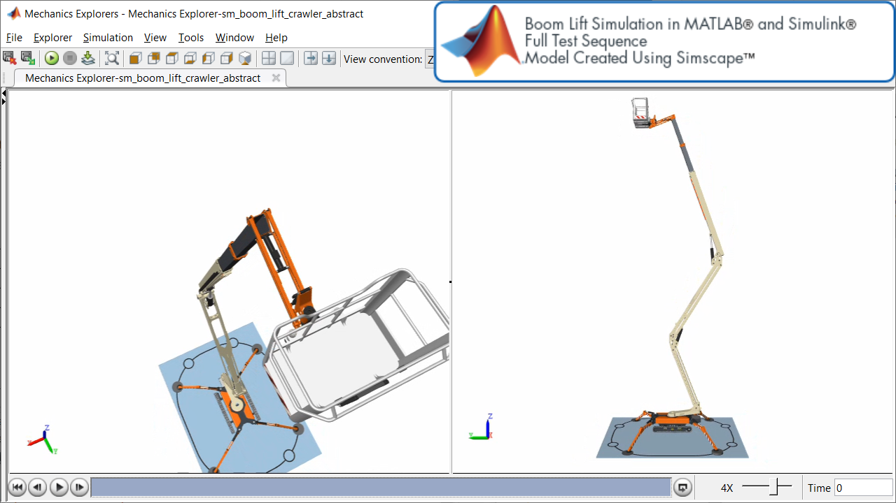
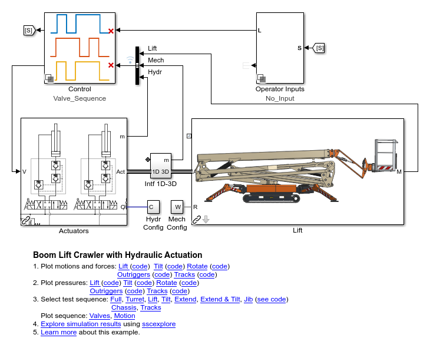
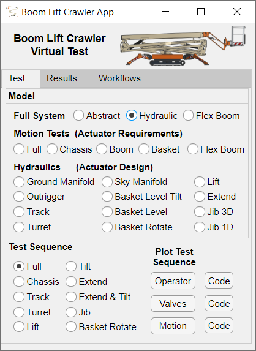

# **Boom Lift Model in Simscape**
Copyright 2020 The MathWorks(TM), Inc.

This example models a boom lift with hydraulic actuators. The lift 
has 6 hydraulic actuators in the chassis, 7 hydraulic actuators in 
the boom plus one other passive hydraulic cylinder. The mechanical model
of the lift was created in CAD software and imported into Simscape Multibody. 

A MATLAB App helps you open the model that best matches your needs. Abstract
models use transfer functions to represent the hydraulic system.  More
detailed models represent the hydraulics with components that match the
schematic that appears in the operators manual. You can also open models 
that only include certain systems, such as the outriggers or the jib.

The model includes a simple control system which restricts some of the 
movements when the lift is in certain positions. Simulink dashboard blocks 
permit manual testing of the algorithm

Open the project file sm_boom_lift_crawler.prj to begin.

## **Boom Lift Model with Hydraulics - Animation**

## **Boom Lift Model with Hydraulics - Model**

## **Boom Lift Model with Hydraulics - MATLAB App**

